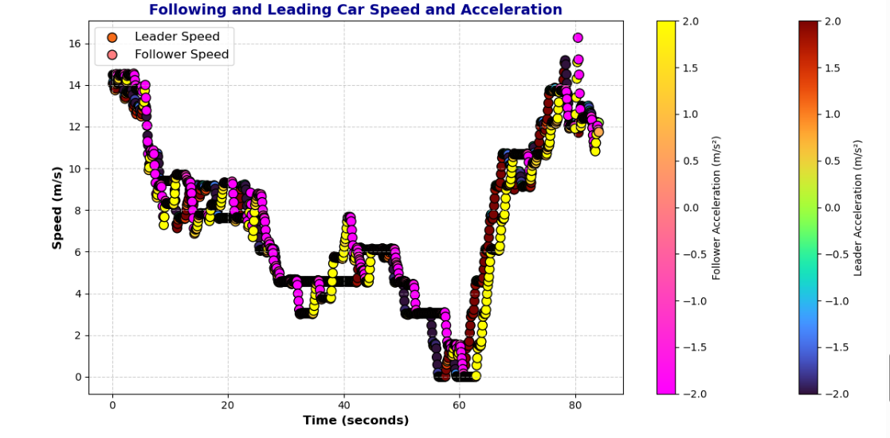

# Grant Helkenn

Welcome to my personal website! Here you'll find information about my background, projects, and interests.

---

## About Me

I am an undergraduate student in Civil Engineering at the University of Nebraska-Lincoln.  
My interests include *data analytics*, and `Python programming`.

---

## Skills

- Python  
- Data Visualization (Matplotlib, Seaborn)  
- Data Analysis  
- Markdown, Git, GitHub Pages
- Project Planning and Scheduling

---

## Projects

### Project 1: Displaying data using tables
In this project we were tasked with using NHTS and NGSIM data to understand driving behavior and transportation system performance. We were tasked with organizing and displaying data to visualize the trends within the given data. My group and I used this data and imported it through the python software which we imported the panda, matplotlib, and seaborn packages to help us obtain our data. This project tought us a lot about how to visualize our data and to perform and execute tasks to organize and make sure everything is displayed correctly. Incorporating teamwork and time management into our projects was a very important role to understand the fundamentals of our work.

  

*This image displays a leader/follower time chart showing the accelerations of each car as they drive to show driving behavior.*

---

### Project 2: Statics Problems
In this project we were tasked with calculating statics problems inside the python software as a practice to use coding for calculations. We learned different shortcuts and math imports that would help us further and make large statics problems a lot easier. We learned to code variable solutions to problems where different inputs would give us the correct answers each time. Learning how to code statics problems was a new learning curve to many as it required us to learn a solid understanding of the packages and software we were working with.

  

*This image displays a statics problem we were tasked with solving and coding a solution that would be able to display correct answers depending on the different variables it presented.*

---

## Connect With Me

- [LinkedIn](https://www.linkedin.com/in/grant-helkenn)  
- [GitHub](https://github.com/GrantHelkenn)  
- [Email Me](mailto:ghelkenn2@huskers.unl.edu)

---

## Navigation

- [Home](index.md)
